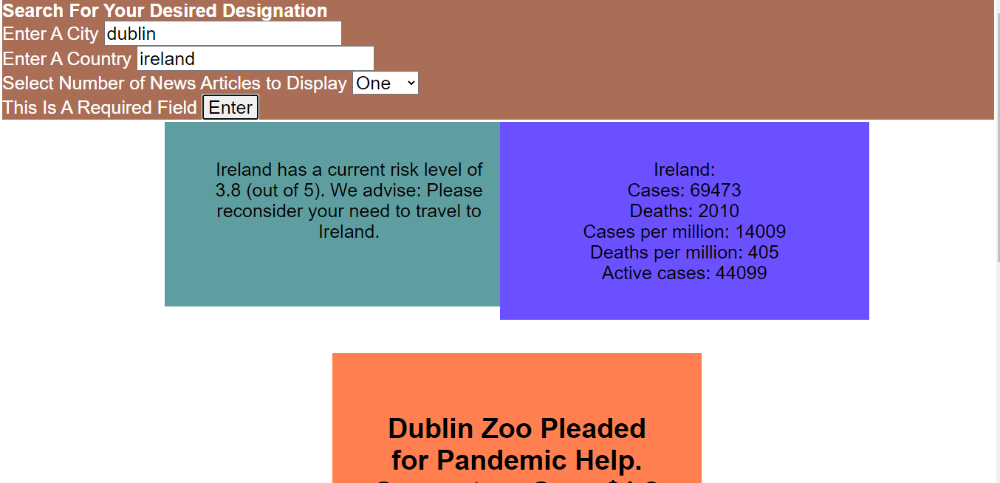

#Safe Travels a Spike Lee joint

As a team, we were tasked by the client with designing a page that would deliver compiled data from multiple sources providing them with safety information while traveling, particularly during the time of Covid. This can be difficult with so many different sources out there so we, after considering many options, chose three reputable sources. These, we hope, will show the overall danger, the specific danger involved with Covid, and also an idea of what is happening locally in most countries and even cities. We were tasked by the client with the following:

Use a CSS framework other than Bootstrap.
Be deployed to GitHub Pages.
Be interactive (i.e., accept and respond to user input).
Use at least two server-side APIs.
Does not use alerts, confirms, or prompts (use modals).
Use client-side storage to store persistent data.
Be responsive.
Have a polished UI.
Have a clean repository that meets quality coding standards (file structure, naming conventions, follows best practices for class/id naming conventions, indentation, quality comments, etc.).
Have a quality README (with unique name, description, technologies used, screenshot, and link to deployed application).

Utilizing our team do the best of each of our strengths, we were able to meet and even exceed these tasks as well as the goals that we set for ourselves as a team.
Together we utilized javascript and jQuery to power our page and CSS along with 3 server side APIs to incorporate data from the US Department of State, the WHO, and the NYTimes.

We have deployed the application at: [Safe Travels](https://hhh-603.github.io/Project-1_Travel-Advisory-Website/)

